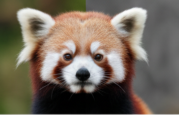
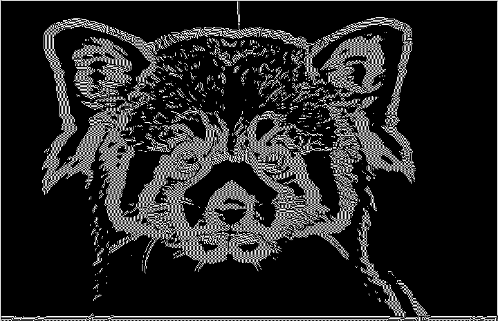

# Canny Edge Detection Algorithm

A Python implementation of the **Canny Edge Detection Algorithm** using **OpenCV** and **NumPy**. This project performs edge detection by applying the main stages of the Canny algorithm, including noise reduction, gradient computation, non-maximum suppression, double thresholding, and hysteresis.

## Features

- Edge detection based on the Canny algorithm
- Image processing with OpenCV
- Numerical computations with NumPy
- Customizable input and output image paths
  
## Requirements

- Python 3.10+
- OpenCV
- NumPy

## Installation

Clone the repository:

```bash
git clone https://github.com/AdemirMonsivais/Canny-edge-algorithm
cd canny
```

Create a virtual environment:

```bash
python3 -m venv .venv
```

Activate the virtual environment:

### Linux / macOS

```bash
source .venv/bin/activate
```

### Windows (Command Prompt)

```cmd
.venv\Scripts\activate.bat
```

### Windows (PowerShell)

```powershell
.venv\Scripts\Activate.ps1
```

It is recommended to keep the virtual environment activated while installing dependencies and running the project.

Install the required packages:

```bash
pip install opencv-python numpy
```

## Configuration

Before running the project, configure the image paths in the source code:

```python
# Adjust these paths according to your needs.
input_image_path = "/home/ade/proyectos/archivo_proyectos/canny/src/images/input/"
output_image_path = "/home/ade/proyectos/archivo_proyectos/canny/src/images/output/"
filename = "panda-rojo.png"
```

### Description

- `input_image_path`: Directory containing the image to process.
- `output_image_path`: Directory where the resulting image will be saved.
- `filename`: Name of the input image.

The program will read the image from:

```text
input_image_path + filename
```

and save the processed result in:

```text
output_image_path
```

## Usage

Run the main script:

```bash
python3 main.py
```

After execution, the output image containing the detected edges will be stored in the configured output directory.

## Example

### Input Image



### Edge Detection Result



## Support

This project is actively maintained. If you encounter any issues, find a bug, or would like to suggest improvements, please open an issue in the repository.

Contributions are welcome.
